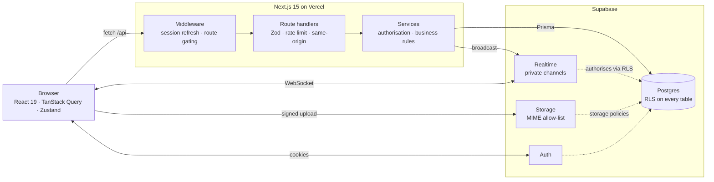

# Pulse

[](https://github.com/DanielPastor05/pulse/actions/workflows/ci.yml)

A realtime messaging app — direct messages, group spaces and public communities.
Next.js 15 (App Router), React 19, TypeScript, Prisma, Supabase, Tailwind v4.

**Live:** https://pulse-blond-two.vercel.app

<!-- SCREENSHOTS -->
<!--
  TODO(dani): añade aquí las capturas antes de enseñar el repositorio.
  Sugerencia de orden y de qué debe verse:
    docs/screenshots/chat.png      — una conversación con mensajes, reacciones
                                     y un adjunto. Que NO salga vacía.
    docs/screenshots/realtime.gif  — dos ventanas lado a lado y un mensaje
                                     apareciendo en la otra sin recargar.
                                     Es lo que mejor vende el proyecto.
    docs/screenshots/discover.png  — comunidades públicas.
  Y bórrate este comentario.
-->

---

## What this is

A chat app that behaves like one: messages arrive without a refresh, presence and
typing indicators are live, attachments and voice notes upload straight to object
storage, and every conversation is protected at the database level rather than by
the API remembering to check.

It is deployed, and the guarantees below are verified against the deployed
instance, not against mocks.

---

## Engineering notes

The interesting part of this project is not the feature list. It is a handful of
problems that were wrong in a way that still looked right, and what was done
about them. Each of these is a real commit.

### Realtime channels were public

Supabase Realtime channels default to public. The app subscribed to
`conversation:<uuid>`, so **anyone holding the publishable key — which ships in
every browser bundle — could subscribe to a conversation id and read the
messages as they were sent.** The REST API was locked down; the live socket
beside it was not.

Fixed with private channels plus RLS policies on `realtime.messages`, so the
database decides who may join a topic. Verified with a six-case authorisation
matrix: member joins, non-member rejected, in both directions.

### Blocking someone was cosmetic

The block check ran on direct conversations only. Creating a group and adding
the person who blocked you defeated it entirely — you were back in a room with
them.

The fix filters blocks in both directions on group creation *and* on adding
members, and it excludes people **silently**: an error saying "that person
blocked you" hands the information straight back to the person being avoided.

### A retry button exposed that sending was not idempotent

Failed messages used to die with a red icon, so a flaky connection meant
retyping. Adding a retry seemed trivial — the send already carried a `clientId`.

Writing the test first showed the premise was false: `clientId` travelled in the
realtime broadcast so the sender could reconcile its optimistic bubble, but it
was **never stored and never checked**. A retry would have posted the message
twice.

That cannot be fixed on the client — the retry exists precisely for when you do
not know whether the message arrived. So the key is now persisted with a unique
index on `(authorId, clientId)`, with a fast-path lookup for the common case and
constraint-violation handling for the real one: two taps racing each other. Four
concurrent sends with the same key produce exactly one message.

### Rate limiting lived in process memory

A `Map` in the Node process. Correct on one instance, useless on serverless:
every cold start resets it and every instance keeps its own count.

Moved to Postgres as a fixed window, one atomic statement doing the whole
read-modify-write. **The trade-off, stated plainly:** at a window boundary a
caller can spend the tail of one window and the head of the next, so the real
burst ceiling is 2×the limit. That is fine for blunting abuse and costs one
round trip instead of the read-modify-write a token bucket needs.

### Link previews are SSRF by construction

Unfurling a link means the server fetches a URL a user typed. The defence is not
one check but several, in `src/server/link-preview.ts`:

- the hostname is **resolved** and every resulting address checked — a name can
  point at `127.0.0.1` and the string tells you nothing;
- every redirect hop is resolved and checked again, since only the first URL is
  under your nose;
- private, loopback, link-local and cloud-metadata ranges are rejected, in IPv4,
  IPv6, and IPv4-mapped-IPv6 form;
- the read is capped in time and in bytes.

The end-to-end tests include a **positive control**. Without one, four "no
preview was created" assertions would pass just as happily if the whole feature
were dead — which is exactly what happened on the first run.

### Monitoring, measured before adopting

Server-side error reporting, with the browser SDK deliberately left out: wiring
it was measured at **+96 kB of first-load JavaScript on every visit**
(`@sentry/core` alone is ~106 kB parsed). Poor trade for a chat app — the errors
you cannot otherwise see are the server ones.

What reaches Sentry is filtered deny-by-default: message bodies, search terms,
drafts and file names are redacted, query strings are dropped whole rather than
filtered key by key, and only the user id survives. Session Replay is off — it
records the DOM, which here is somebody's private conversation.

---

## Architecture



Two things worth pointing at:

**Authorisation lives in the database.** RLS is enabled on all 17 tables, and
the realtime topics are gated by the same policies. If a route handler forgets a
check, Postgres still refuses. Membership helpers are `SECURITY DEFINER`
functions in a `private` schema so PostgREST never exposes them as RPC.

**Broadcasts carry enriched DTOs, not raw rows.** The payload pushed over the
socket is byte-for-byte what the REST endpoint would return, so the client needs
no second round trip to render a new message.

---

## Testing

94 checks, in two layers.

```bash
npm test          # 25 unit tests — pure logic, no I/O
npm run test:e2e  # 69 checks against a running server + real Supabase
```

The unit tests cover the things where an edge case is the whole point: URL
protocol validation, the SSRF address rules including the `172.16/12` boundary
and IPv4-mapped IPv6, Open Graph parsing, and the Sentry scrubbing.

The end-to-end suites talk to a **real** server, database, auth and object
storage. That is deliberate: what they check — block enforcement, rate limiting,
storage MIME rules, realtime authorisation — only exists once a request has been
through middleware, a route handler, Prisma and Postgres. A mock of any of those
would be testing the mock. They create throwaway accounts and delete them on the
way out.

```bash
E2E_APP_URL=https://pulse-blond-two.vercel.app npm run test:e2e
```

**CI runs typecheck, lint, unit tests and build on every push.** The end-to-end
suites are excluded on purpose: they need a live server and real credentials,
and they create real accounts — running them on every push would fill the
production database with test data.

---

## Setup

```bash
npm install
cp .env.example .env   # then fill it in
npm run db:push
npm run dev
```

`.env.example` documents every variable and which are optional. The short
version: Supabase URL and keys plus two Postgres connection strings are
required; Tenor (GIF picker), VAPID (web push) and Sentry (error reporting) are
optional and the app runs without them.

Both connection strings go through Supavisor, the Supabase pooler. `DATABASE_URL`
uses transaction mode on port 6543 with `connection_limit=10`; `DIRECT_URL` uses
session mode on 5432, which `prisma db push` needs because the pooler does not
support the protocol it speaks.

`prisma/sql/security.sql` is the reproducible source of truth for everything
Prisma cannot express: RLS policies, the realtime authorisation rules, storage
buckets and their MIME allow-lists, trigram indexes, and the account-deletion
trigger.

### Scripts

```bash
npm run dev         npm run build       npm run start
npm run typecheck   npm run lint        npm test
npm run test:e2e    npm run db:push     npm run db:studio
```

---

## Known limits

Written down rather than glossed over:

- **Rate limiting is a fixed window**, so the real burst ceiling is 2×the limit
  at a window boundary.
- **The CSP allows `'unsafe-inline'` for scripts.** Removing it needs
  per-request nonces, which would opt every static page into dynamic rendering.
  The directives that cost nothing — `object-src 'none'`, `base-uri`,
  `frame-ancestors`, `form-action` — are all set.
- **Search uses trigram `ILIKE`.** Fast into the millions of rows with the
  indexes in `security.sql`; swap for `tsvector` if you need ranking.
- **Outbound email goes through Gmail SMTP**, capped around 500 messages a day.
  Fine for a beta, and the ceiling to watch first.
- **Voice notes record to WebM**, which older iOS Safari does not produce; the
  recorder falls back to whatever `MediaRecorder` offers.
